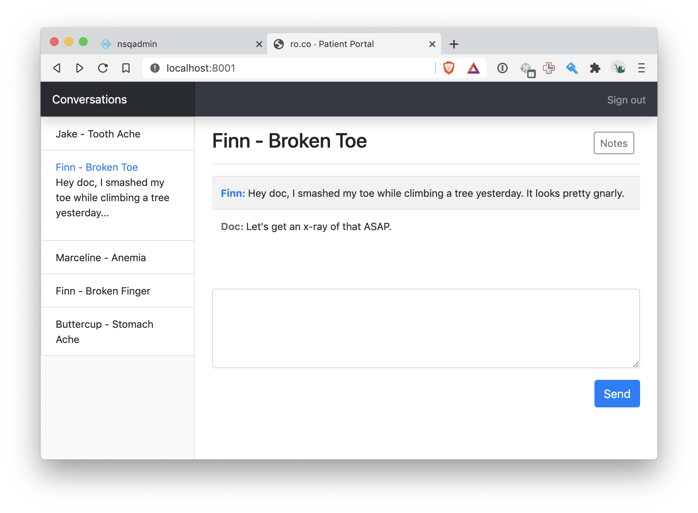

# Communication Portal

This a proof of concept for a real time chat app.

Messages are submitted from the browser to an API, where they are then placed into a queue with all other messages. A worker reads from that queue and routes the message to a dedicated topic for that conversation, in addition to saving the message to Postgres. Multiple clients can subscribe to the conversation topic simultaneously to receive a copy of each message.

For this example, the browser connects to an API endpoint, which creates an ephemeral channel to read messages from the queue and send them back down to the browser via server sent events.


## Requirements

* Docker
* Python
* Tornado
* NSQ
* PostgreSQL


## Running locally

```
$ docker-compose up -d
```

## Services

* [Frontend](http://localhost:8001)
* [API](http://localhost:8000)
* [NSQ Admin](http://localhost:4171/)

To view the web ui, open two browsers to see messages fan out to multiple clients.

```
$ open http://localhost:8001
$ open http://localhost:8001
```

Messages are also logged to disk.
```
$ tail -f data/*
```

## Screenshots


